# 📊 Análise de Vendas E-commerce - Projeto Data Science

## 🎯 Objetivo do Projeto
Este projeto demonstra uma análise completa de dados de vendas de um e-commerce, utilizando Python para extrair insights estratégicos que podem orientar decisões de negócio. O foco está na limpeza, exploração e visualização de dados para gerar recomendações acionáveis, com um **dashboard interativo web** para análise em tempo real.

## 🚀 Tecnologias Utilizadas

### Core Libraries
- **Python 3.8+**
- **Pandas**: Manipulação e análise de dados
- **NumPy**: Computação numérica e álgebra linear
- **Matplotlib**: Visualizações estáticas
- **Seaborn**: Visualizações estatísticas avançadas
- **Plotly**: Gráficos interativos
- **Streamlit**: Dashboard web interativo

### Ambiente de Desenvolvimento
- **Jupyter Notebook**: Desenvolvimento interativo
- **Git**: Controle de versão

## 📁 Estrutura do Projeto

```
ecommerce-analysis/
│
├── data/
│   ├── raw/                    # Dados brutos (Excel/CSV)
│   ├── processed/              # Dados limpos e processados
│   └── sample/                 # Dados de exemplo
│
├── docs/
│   └── screenshots/            # Screenshots do dashboard
│       ├── 01_visao_geral.png
│       ├── 02_distribuicao.png
│       ├── 03_insights.png
│       ├── 05_produtos_graficos.png
│       ├── 06_produto_destaque.png
│       ├── 07_categorias.png
│       ├── 08_categorias_tabela.png
│       ├── 09_geografia_receita.png
│       ├── 10_geografia_metricas.png
│       ├── 11_canais.png
│       ├── 12_canais_tabela.png
│       └── 13_clientes.png
│
├── notebooks/
│   └── analise_vendas_interativa.md  # Template para análise
│
├── data_processing.py          # Processamento e limpeza de dados
├── visualization.py            # Visualizações com Matplotlib/Seaborn
├── business_analysis.py        # Análises estratégicas e insights
├── main.py                     # Executor principal do projeto
├── dashboard_app.py            # 🎯 Dashboard interativo Streamlit
├── setup.py                    # Configuração do ambiente
│
├── reports/
│   ├── figures/                # Gráficos gerados
│   ├── insights/               # Relatórios de insights
│   └── RELATORIO_EXECUTIVO_VENDAS.md
│
├── requirements.txt            # Dependências do projeto
└── README.md                   # Este arquivo
```

## 📊 Dataset

### Estrutura dos Dados
O dataset contém informações de vendas com as seguintes colunas:

| Coluna | Tipo | Descrição |
|--------|------|-----------|
| `pedido_id` | string | Identificador único do pedido |
| `data_pedido` | datetime | Data de realização do pedido |
| `cliente_id` | int | Identificador do cliente |
| `produto` | string | Nome do produto |
| `categoria` | string | Categoria do produto |
| `quantidade` | int | Quantidade vendida |
| `preco_unitario` | float | Preço unitário do produto |
| `valor_total` | float | Valor total do pedido |
| `estado` | string | Estado do cliente |
| `canal_venda` | string | Canal de venda utilizado |

### Fonte dos Dados
- **Dados Simulados**: Para demonstração do projeto
- **Dados Reais**: Substitua pela importação de planilhas Excel/CSV reais

## 🔍 Análises Realizadas

### 1. Análise Exploratória (EDA)
- Estatísticas descritivas
- Identificação de valores nulos
- Detecção e tratamento de outliers
- Distribuição das variáveis numéricas

### 2. Métricas de Negócio
- 💰 **Receita Total**: Faturamento geral da empresa
- 🎫 **Ticket Médio**: Valor médio por pedido
- 📦 **Volume de Pedidos**: Quantidade total de transações
- 🏆 **Top Produtos**: Ranking por vendas e receita
- 📊 **Análise por Categoria**: Performance de cada segmento

### 3. Análise Temporal
- 📅 **Sazonalidade**: Identificação de padrões sazonais
- 📈 **Tendências**: Evolução das vendas ao longo do tempo
- 🔥 **Heatmap**: Vendas por dia da semana e mês

### 4. Análise Geográfica
- 🗺️ **Vendas por Estado**: Distribuição geográfica da receita
- 🎯 **Concentração Regional**: Identificação de mercados principais

### 5. Análise de Canais
- 📱 **Performance por Canal**: Online, Marketplace, Mobile
- 💹 **Comparativo de Eficiência**: Ticket médio por canal

### 6. Segmentação de Clientes (RFV)
- 👥 **Análise RFV**: Recência, Frequência, Valor
- 🎖️ **Segmentação**: Champions, Loyal Customers, At Risk, etc.
- 💎 **Top Clientes**: Identificação dos principais compradores

## 📈 Principais Insights

### Insights de Produto
- 🏆 Identificação dos produtos com maior potencial de receita
- 📊 Categorias com melhor performance financeira
- 🎯 Oportunidades de cross-selling e up-selling

### Insights de Marketing
- 📱 Canais de venda mais eficazes
- 🗺️ Regiões com maior potencial de expansão
- 📅 Períodos sazonais para campanhas

### Insights de Operação
- 📦 Padrões de demanda para gestão de estoque
- 🚚 Otimização logística por região
- 💰 Estratégias de precificação

## 🚀 Como Executar o Projeto

### Opção 1: Dashboard Interativo (Recomendado) 🌟

#### 1. Clone o Repositório
```bash
git clone https://github.com/costaendriw/ecommerce-analysis.git
cd ecommerce-analysis
```

#### 2. Instale as Dependências
```bash
pip install -r requirements.txt
```

#### 3. Execute o Dashboard
```bash
streamlit run dashboard_app.py
```

#### 4. Acesse no Navegador
O dashboard abrirá automaticamente em: `http://localhost:8501`

### Funcionalidades do Dashboard:
- ✅ Upload de arquivos CSV/Excel pela interface
- ✅ Geração de dados simulados para teste
- ✅ Filtros interativos (categoria, canal, período)
- ✅ 6 abas de análise detalhada
- ✅ Gráficos interativos com Plotly
- ✅ Exportação de dados (CSV, Excel, Relatório)
- ✅ Insights estratégicos automáticos

### Opção 2: Análise Completa via Script

```bash
python main.py
```

Isso executará a análise completa e gerará:
- Dados processados em `data/processed/`
- Gráficos em `reports/figures/`
- Relatórios em `reports/insights/`
- Dashboard executivo em `reports/figures/executive_dashboard.png`

### Opção 3: Análise Interativa com Jupyter

```bash
jupyter notebook notebooks/analise_vendas_interativa.md
```

## 📊 Preview do Dashboard

### 🎯 Visão Geral
Interface principal com métricas em tempo real e análises consolidadas.

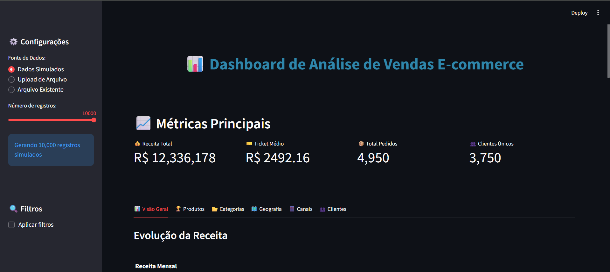

### 📊 Distribuições por Categoria e Canal
Análise visual da distribuição de receita por categoria e canal de vendas.

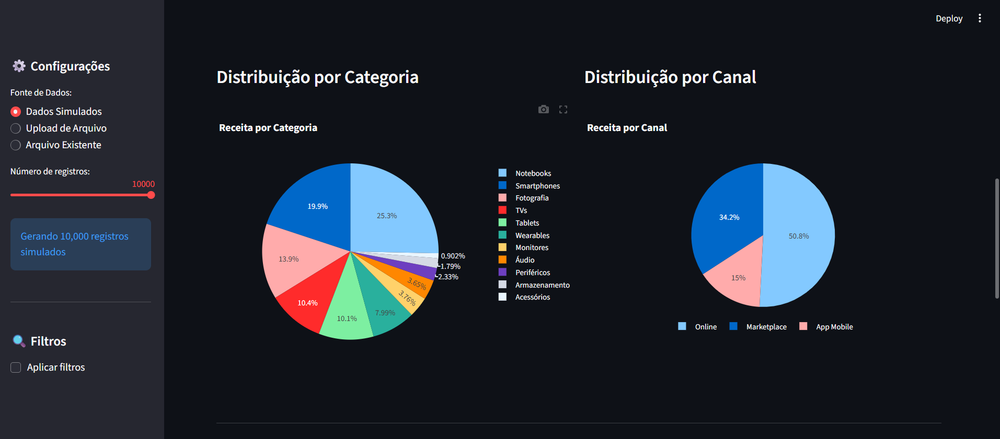

### 💡 Insights Estratégicos
Sistema automatizado de geração de insights, oportunidades e recomendações.

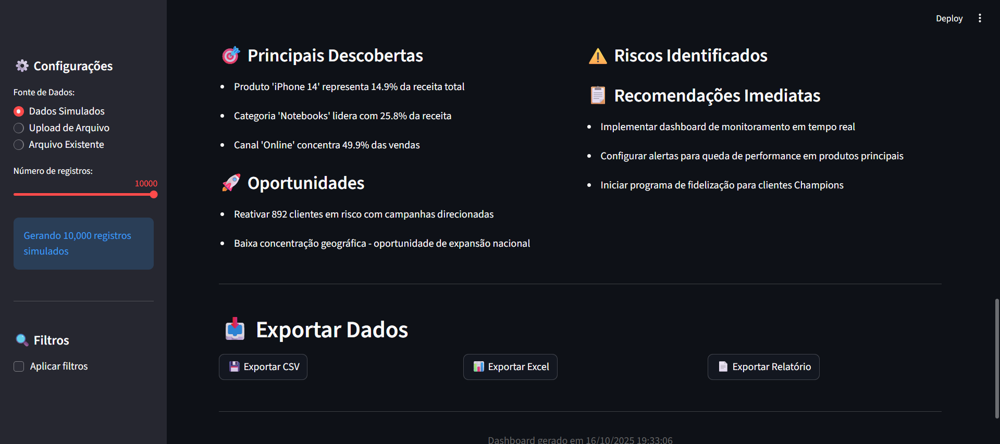

### 🏆 Análise de Produtos
Ranking completo dos produtos mais vendidos por receita e volume.

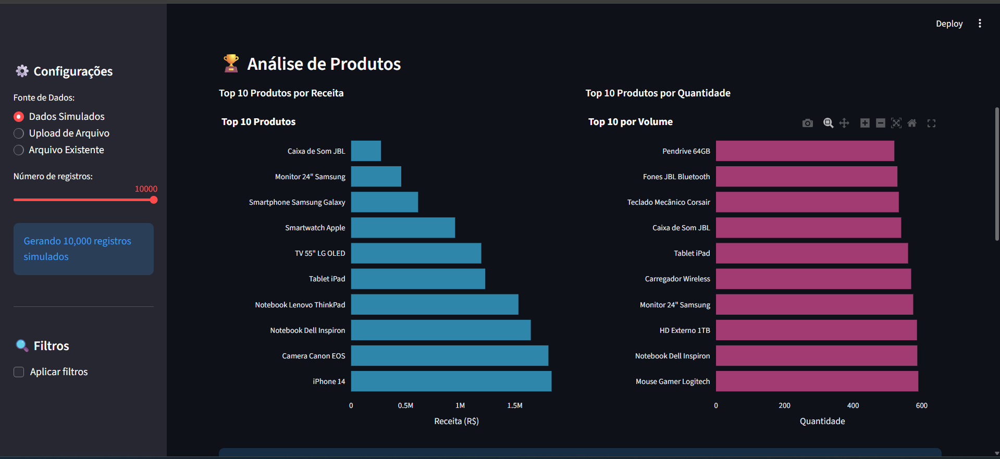

**Produto em Destaque:**

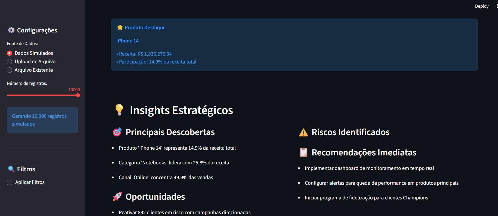

### 📂 Análise de Categorias
Performance detalhada de cada categoria com métricas comparativas.

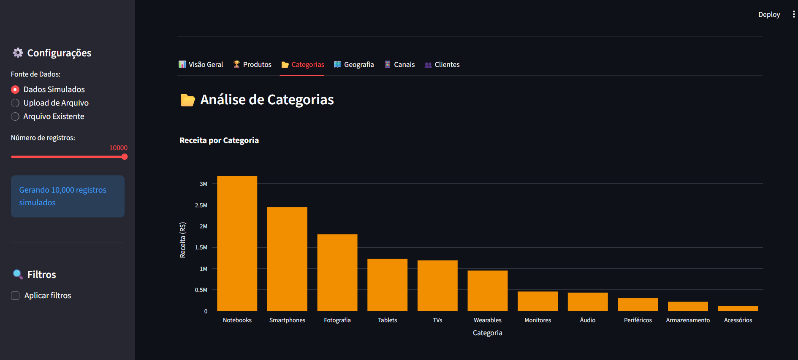

**Detalhamento por Categoria:**

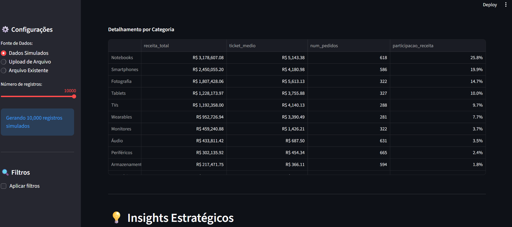

### 🗺️ Análise Geográfica
Distribuição de vendas por estado e análise regional.

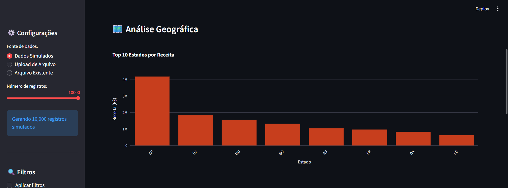

**Métricas por Estado:**

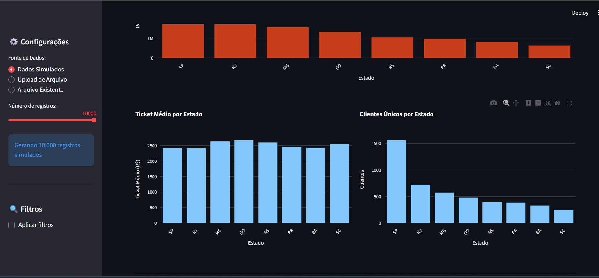

### 📱 Análise de Canais
Performance comparativa entre canais de venda (Online, Marketplace, App Mobile).

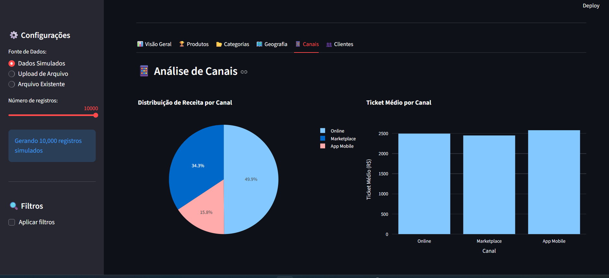

**Performance Detalhada:**

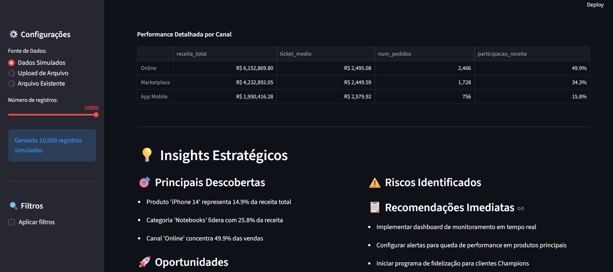

### 👥 Segmentação de Clientes (RFV)
Análise completa baseada em Recência, Frequência e Valor com segmentação automática.

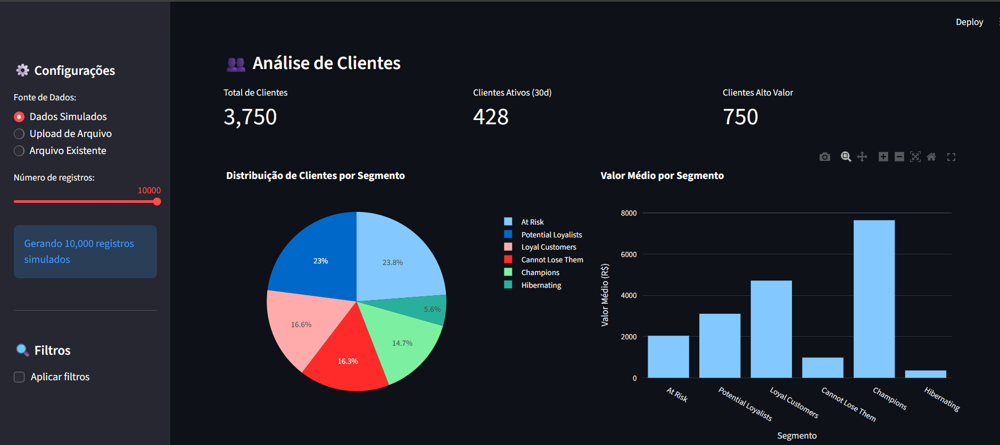

---

## 📋 Requirements

```txt
# Core Data Science Libraries
pandas>=1.5.0
numpy>=1.21.0

# Visualization Libraries
matplotlib>=3.5.0
seaborn>=0.11.0
plotly>=5.0.0

# Jupyter Environment
jupyter>=1.0.0
notebook>=6.0.0
ipywidgets>=7.6.0

# Excel/CSV Processing
openpyxl>=3.0.0
xlrd>=2.0.0

# Statistical Analysis
scipy>=1.7.0
statsmodels>=0.13.0
scikit-learn>=1.0.0

# Utility Libraries
python-dateutil>=2.8.0
pytz>=2021.3

# Interactive Dashboard
streamlit>=1.28.0
```

## 📊 Visualizações Disponíveis

### Dashboard Interativo (Streamlit)
**Funcionalidades:**
- ✅ **Interface intuitiva** com sidebar de configurações
- ✅ **Dados simulados** ou upload de arquivos próprios
- ✅ **Filtros dinâmicos** por categoria, canal e período
- ✅ **6 abas de análise** completamente interativas
- ✅ **Gráficos Plotly** com zoom, hover e exportação
- ✅ **Insights automáticos** gerados pela IA de análise
- ✅ **Exportação** de dados em CSV, Excel e relatórios
- ✅ **Métricas em tempo real** atualizadas dinamicamente

**Abas disponíveis:**
1. 📊 **Visão Geral**: KPIs principais e evolução temporal
2. 🏆 **Produtos**: Ranking e análise de performance
3. 📂 **Categorias**: Comparativo entre categorias
4. 🗺️ **Geografia**: Distribuição por estados
5. 📱 **Canais**: Performance por canal de venda
6. 👥 **Clientes**: Segmentação RFV e comportamento

### Gráficos Estáticos (Matplotlib/Seaborn)
- Evolução da receita (diária/semanal/mensal/trimestral)
- Top produtos por diferentes métricas
- Análise completa por categoria
- Análise geográfica detalhada
- Análise de canais de venda
- Padrões sazonais e heatmaps
- Segmentação RFV de clientes

### Gráficos Interativos (Plotly)
- Todos os gráficos com zoom, hover e filtros
- Exportação em PNG de alta qualidade
- Visualizações responsivas

## 🔄 Fluxo de Análise

```
1. Carregamento de Dados
   ↓
2. Limpeza e Validação
   ↓
3. Análise Exploratória
   ↓
4. Geração de Métricas
   ↓
5. Análise de Negócio
   ↓
6. Visualizações
   ↓
7. Insights e Recomendações
   ↓
8. Relatórios Executivos
```

## 🎯 Roadmap Futuro

### Análises Avançadas
- [ ] **Machine Learning**: Previsão de vendas com ARIMA/Prophet
- [ ] **Análise de Coorte**: Comportamento de clientes ao longo do tempo
- [ ] **Market Basket Analysis**: Produtos frequentemente comprados juntos
- [ ] **Modelagem Preditiva**: Previsão de churn de clientes
- [ ] **Clustering**: Segmentação automática de clientes com K-means

### Melhorias Técnicas
- [x] **Dashboard Interativo**: Streamlit implementado
- [ ] **Automatização**: Scripts para atualização automática de dados
- [ ] **API REST**: Endpoint para consultas em tempo real
- [ ] **Deploy**: Hospedagem em Streamlit Cloud/Heroku
- [ ] **Testes**: Implementação de testes unitários
- [ ] **CI/CD**: Pipeline de integração contínua

### Novas Features
- [ ] **Alertas**: Notificações para anomalias nas vendas
- [ ] **Relatórios Agendados**: Envio automático por email
- [ ] **Integração**: Conexão com APIs de e-commerce
- [ ] **Mobile**: Versão otimizada para dispositivos móveis

## 👨‍💻 Sobre o Autor

**Endriw Costa**
- 📧 Email: endriwcosta3@gmail.com
- 💼 LinkedIn: [linkedin.com/in/endriwcosta](https://www.linkedin.com/in/endriwcosta)
- 🌐 Portfolio: [github.com/costaendriw](https://github.com/costaendriw)

Cientista de Dados com foco em análise exploratória, visualização de dados e geração de insights de negócio.

## 📄 Licença

Este projeto está sob a licença MIT. Veja o arquivo `LICENSE` para mais detalhes.

## 🤝 Contribuições

Contribuições são sempre bem-vindas! Para contribuir:

1. Fork o projeto
2. Crie uma branch para sua feature (`git checkout -b feature/AmazingFeature`)
3. Commit suas mudanças (`git commit -m 'Add some AmazingFeature'`)
4. Push para a branch (`git push origin feature/AmazingFeature`)
5. Abra um Pull Request

## 📝 Changelog

### v2.0.0 (Atual)
- ✅ Dashboard interativo com Streamlit
- ✅ Gráficos interativos com Plotly
- ✅ Exportação de dados e relatórios
- ✅ Filtros dinâmicos
- ✅ Análise RFV de clientes

### v1.0.0
- ✅ Análise exploratória completa
- ✅ Visualizações estáticas
- ✅ Relatórios em PDF/Markdown
- ✅ Sistema modular de análise

## 📊 Resultados do Projeto

Este projeto demonstra:
- ✅ **Competência Técnica**: Domínio de Python, Pandas, visualização e web apps
- ✅ **Pensamento Analítico**: Capacidade de extrair insights de dados
- ✅ **Visão de Negócio**: Conexão entre dados e decisões estratégicas
- ✅ **Comunicação**: Apresentação clara de resultados complexos
- ✅ **Engenharia**: Código limpo, modular e bem documentado

## 🎓 Aprendizados

- Limpeza e tratamento de dados reais
- Análise exploratória sistemática
- Criação de dashboards interativos
- Storytelling com dados
- Automação de processos de análise
- Deploy de aplicações web

## 📚 Recursos Adicionais

- [Documentação Pandas](https://pandas.pydata.org/docs/)
- [Documentação Streamlit](https://docs.streamlit.io/)
- [Documentação Plotly](https://plotly.com/python/)
- [Guia de Visualização de Dados](https://www.storytellingwithdata.com/)

---

⭐ **Se este projeto foi útil para você, não esqueça de dar uma estrela!**

📧 **Dúvidas ou sugestões?** Entre em contato: endriwcosta3@gmail.com